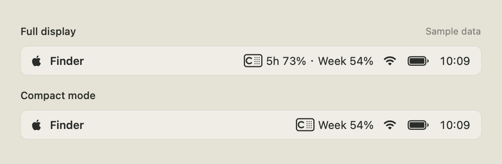

<p align="center">
  
</p>

<p align="center">
  <a href="https://github.com/youcaihua007/codex-t3/releases/latest"><b>Download for macOS</b></a> &nbsp; · &nbsp;
  <a href="README.md">简体中文</a> &nbsp; · &nbsp;
  <a href="docs/USAGE.en.md">User guide</a> &nbsp; · &nbsp;
  <a href="https://github.com/youcaihua007/codex-t3/issues/new/choose">Feedback</a>
</p>

# Codex T3 · Usage Limits Widget

**Small app. Simple design. Usage at a glance.**

The 1.1 universal download is about **2.42 MB**, and the app itself is about **7.45 MB**. A native macOS widget that keeps the remaining allowance for the Codex account signed in on this Mac visible on your desktop and in the menu bar. Warm ivory, restrained type, dot grids and progress bars, inspired by Braun T3.


## Usage in your menu bar



The full display shows the **remaining percentages for all available usage limits**; the example has five-hour and weekly limits. Compact mode shows **only the limit with the least remaining allowance**. Toggle the icon and allowance independently in Display settings.

## See what you have left

| Desktop | Menu bar | Reminders |
| --- | --- | --- |
| Small and medium sizes; percentages, progress bars and reset dates | Separate icon and allowance switches; optional compact display | Low allowance, restoration, account changes and reset expiry |
| Adapts to the usage windows Codex actually returns | Optional launch at login; sync continues after closing Settings | Unused weekly allowance, with a short widget note |

- **Refresh every 1 / 2 / 5 minutes**, or use the widget's refresh button.
- **Know which account is active**, with its name, email and plan in Settings.
- **English / 简体中文**: follows the system at first launch, with a manual language choice.
- **Local queries**: no app telemetry or account, usage or log uploads.

## Download and install

**[Download the latest DMG](https://github.com/youcaihua007/codex-t3/releases/latest)** · 1.1 (build 52) · about 2.42 MB · Apple Silicon + Intel

1. Download and open `Codex-T3-1.1-universal.dmg`.
2. Drag **Codex T3.app** to **Applications** on the right.
3. Open the installed app from Applications, then eject the disk image.
4. Check your account and usage in Account / Sync.
5. Right-click the desktop → **Edit Widgets** → search for **Codex T3**, then add a small or medium widget.

1.1 fixes update checks affected by GitHub's public REST API rate limit. If 1.0 still reports a failed check, download 1.1 above and replace the app; your settings are preserved. Future checks prefer the manifest attached to the latest release.

### macOS blocks the first launch?

> **Version 1.1 is ad-hoc signed and has not been notarized by Apple. A browser download may require manual approval on first launch.**

After verifying that the download came from this repository's Releases, try opening the app, then go to **System Settings → Privacy & Security**. Find the blocked Codex T3 entry, click **Open Anyway**, and confirm **Open**. This creates an exception for this app; you do not need to disable system security. See [Apple's instructions](https://support.apple.com/en-us/102445).

If macOS reports damage or malicious content, download again and check the SHA-256, or report the issue. Do not hide the problem by disabling Gatekeeper or removing quarantine attributes.

### Requirements

**macOS 14 or later**, and a compatible Codex executable with `app-server` support, signed in with a **ChatGPT account**. API key authentication does not expose the subscription usage limits this app needs. You can select the executable in Settings if automatic discovery fails.

Tested on **macOS 27.0.1 / Apple Silicon**. A user also confirmed working widgets on **macOS 27.0 / M4** after removing old copies and reinstalling. macOS 14–26 and Intel hardware have not been runtime-tested.

## Keep it simple


Four settings tabs: **Account · Display · Alerts · About**. Notifications default to off. Each switch explains its purpose, shows a preview, and places its options directly below it.

The unused weekly allowance reminder supports **6 / 12 / 24 / 48 / 72 hours** before the reset and a custom threshold. It reuses normal refreshes and requires at least one hour of valid samples. When its conditions are met, it sends a notification and shows a short widget note.

[Display](docs/images/en/display.png) · [About and updates](docs/images/en/about.png) · [Full user guide](docs/USAGE.en.md)

## Questions

<details>
<summary><b>Settings shows usage, but the widget is empty?</b></summary>

Run only the copy in Applications. Quit old copies from Downloads or a mounted disk image. After installing an update, open the installed app and sync, then remove and re-add the desktop widget. WidgetKit controls desktop redraws, which may lag behind the app. If this persists, report your macOS, chip, app and Codex versions without account details or sign-in files.

</details>

<details>
<summary><b>Which account does it use? What happens on another Mac?</b></summary>

The package includes no author's account. It reads the sign-in used by the selected Codex executable on this Mac and checks the account on each refresh. Another Mac uses its own account. For custom login directories or `CODEX_HOME`, see the [user guide](docs/USAGE.en.md).

</details>

<details>
<summary><b>Does it need to keep running? How do I update?</b></summary>

Keep the app running in the background; you can close Settings. Quitting leaves the last reading in the widget and marks sync as unavailable. Use Check for Updates in About, or quit the old app and replace it using a new DMG. ZIP assets are for the built-in updater; choose the DMG for a first installation.

</details>

## Development and privacy

[Build and release guide](docs/RELEASING.md) · [Contributing](CONTRIBUTING.md) · [Security & privacy](SECURITY.md) · [Changelog](CHANGELOG.md)

```sh
python3 Scripts/test.py
python3 Scripts/test-sandbox-bridge.py
python3 Scripts/build.py --arch universal --derived-data /tmp/codex-t3-release
```

Full builds require Xcode 27. The repository contains source, original artwork, synthetic screenshots and tests; installers are in Releases. Widget messages and caches exclude names, emails, account IDs and sign-in tokens. English copy uses usage limits, remaining allowance and rate-limit resets; resets are separate from purchased usage credits.

---

[MIT](LICENSE) · An independent third-party project, not affiliated with or endorsed by OpenAI or Braun. T3 is a design reference.
