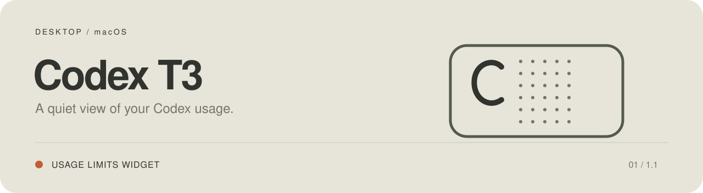
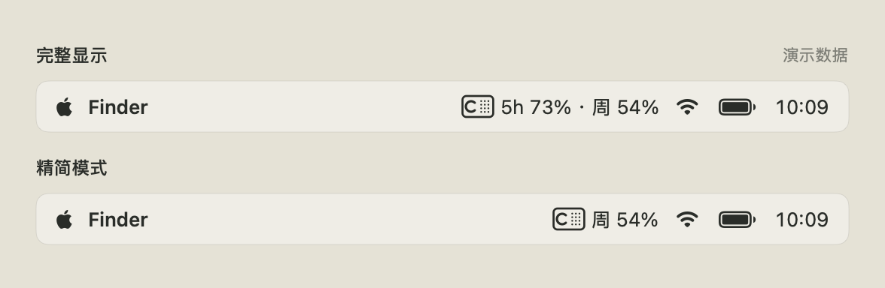

<p align="center">
  
</p>

<p align="center">
  <a href="https://github.com/youcaihua007/codex-t3/releases/latest"><b>下载 macOS 版</b></a> &nbsp; · &nbsp;
  <a href="README.en.md">English</a> &nbsp; · &nbsp;
  <a href="docs/USAGE.md">使用指南</a> &nbsp; · &nbsp;
  <a href="https://github.com/youcaihua007/codex-t3/issues/new/choose">建议与反馈</a>
</p>

# Codex T3 · 额度小组件

**小体积，简约显示，额度一眼可见。**

1.1 通用版安装包约 **2.42 MB**，App 本体约 **7.45 MB**。原生 macOS 小组件，跟随这台 Mac 的 Codex 登录，在桌面和菜单栏查看剩余额度。暖白底色、克制的文字、点阵与进度条，灵感来自 Braun T3。


## 菜单栏里，也能看额度



完整显示展示**所有可用额度的剩余百分比**，图中以 5 小时和每周额度为例；精简模式只显示**余量最少的一项**。图标和额度可分别开关，在「显示与启动」中设置。

## 看一眼，就知道还能用多少

| 桌面 | 菜单栏 | 提醒 |
| --- | --- | --- |
| 小、中两种尺寸；额度、进度条与重置日期 | 图标与额度分别开关；可选精简显示 | 低额度、额度恢复、账号切换、重置卡到期 |
| 自动适配 Codex 实际返回的额度窗口 | 可选登录启动；关闭设置仍在后台同步 | 每周余量使用提醒，也可在组件显示小字 |

- **每 1 / 2 / 5 分钟刷新**，也可点击小组件右上角手动刷新。
- **账号清楚可见**，设置显示当前账号名称、邮箱与方案。
- **中文 / English**，首次跟随系统，也可手动切换。
- **本机查询**，应用没有遥测，不上传账号、额度或日志。

## 下载与安装

**[下载最新 DMG](https://github.com/youcaihua007/codex-t3/releases/latest)** · 1.1（构建 52）· 约 2.42 MB · Apple Silicon + Intel

1. 下载 `Codex-T3-1.1-universal.dmg` 并双击打开。
2. 把 **Codex T3.app** 拖到右侧 **Applications（应用程序）**。
3. 复制完成后，从「应用程序」打开 Codex T3，再推出安装磁盘。
4. 确认「账号与同步」已显示本机账号和额度。
5. 在桌面空白处右键 → **编辑小组件** → 搜索 **Codex T3**，添加小或中尺寸。

1.1 修复了检测更新受 GitHub 公共 API 限流影响的问题。若 1.0 仍提示检测失败，请从上方链接下载 1.1 并替换应用；设置会保留。以后检测优先使用发布附件中的更新清单。

### 首次打开被 macOS 拦截？

> **1.1 使用 ad-hoc 签名，尚未经过 Apple 公证。浏览器下载后，首次打开可能需要手动允许。**

确认文件来自本仓库的 Releases 后：先尝试打开应用，再进入 **系统设置 → 隐私与安全性**，找到 Codex T3 的拦截提示，点击 **仍要打开（Open Anyway）**，并在后续确认框中点击「打开」。这是对该应用的单独放行；无需关闭系统安全保护。详细流程见 [Apple 官方说明](https://support.apple.com/zh-cn/102445)。

若系统明确提示文件损坏或有恶意内容，请重新下载并核对 SHA-256，或提交反馈。不要通过关闭 Gatekeeper 或删除隔离属性来掩盖问题。

### 运行条件

需要 **macOS 14 或以上**，以及本机已通过 **ChatGPT 账号登录**、支持 `app-server` 的 Codex 程序。API Key 登录不提供此应用所需的订阅额度。自动查找失败时，可在设置中选择 Codex 可执行程序。

已在 **macOS 27.0.1 / Apple Silicon** 验证；另有 **macOS 27.0 / M4** 清理旧副本后重新安装成功的反馈。macOS 14–26 与 Intel 硬件尚未实机验证。

## 保持简单


四个设置页：**账号与同步 · 显示与启动 · 预警与通知 · 关于**。通知默认关闭；每项开关都有说明和效果示例，选项紧跟在开关下面。

每周余量提醒可提前 **6 / 12 / 24 / 48 / 72 小时**，并自由设置余量阈值。它复用正常刷新，需至少一小时有效采样；条件满足时发送通知，并在小组件显示一行小字。

[显示与启动](docs/images/设置-display.png) · [预警与通知](docs/images/设置-alerts.png) · [关于与更新](docs/images/设置-about.png) · [详细使用指南](docs/USAGE.md)

## 常见问题

<details>
<summary><b>设置里能看到额度，小组件却没有内容？</b></summary>

先确认只运行「应用程序」中的一份 Codex T3；退出下载目录或安装磁盘中的旧副本。安装新版本后，从「应用程序」重新打开并同步，然后移除旧桌面组件，再添加一次。桌面更新最终由 WidgetKit 调度，可能晚于主程序读数。仍未恢复时，请附系统、芯片、应用和 Codex 版本反馈；不要附账号或登录文件。

</details>

<details>
<summary><b>会不会绑定作者账号？换电脑怎么办？</b></summary>

安装包不含作者账号。应用读取这台电脑所选 Codex 程序的登录，每轮刷新核对账号；换电脑后使用那台电脑的账号。多登录目录或自定义 `CODEX_HOME` 请参阅[使用指南](docs/USAGE.md)。

</details>

<details>
<summary><b>需要一直开着吗？怎么更新？</b></summary>

主程序需要在后台运行，关闭设置窗口即可。完全退出后，组件保留上次读数并显示无法同步。在「关于」点击「检测更新」；也可下载新版 DMG，退出旧应用后拖拽替换。`ZIP` 附件供内置更新使用，首次安装请选择 `DMG`。

</details>

## 开发与隐私

[从源码构建与发布](docs/RELEASING.md) · [贡献指南](CONTRIBUTING.md) · [隐私与安全](SECURITY.md) · [更新记录](CHANGELOG.md)

```sh
python3 Scripts/test.py
python3 Scripts/test-sandbox-bridge.py
python3 Scripts/build.py --arch universal --derived-data /tmp/codex-t3-release
```

完整构建需要 Xcode 27。仓库只含源码、原创图标、演示截图与测试；安装包在 Releases。组件通信和缓存不含姓名、邮箱、账号 ID 或登录 token。

---

[MIT](LICENSE) · 独立第三方项目，与 OpenAI 或 Braun 无隶属或认可关系。T3 仅为设计灵感。
