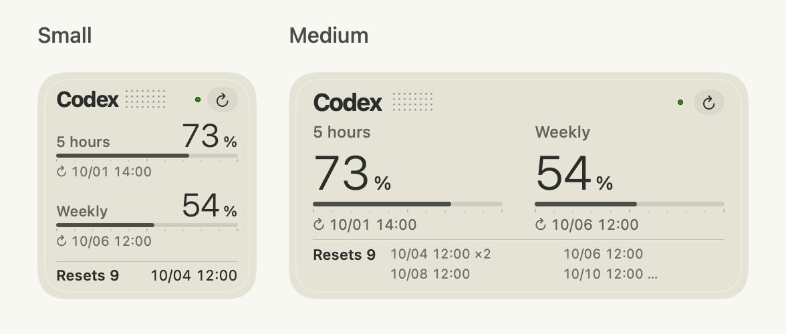
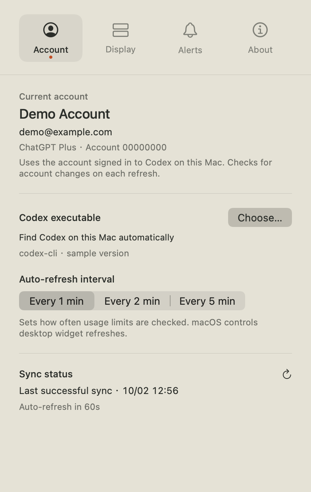
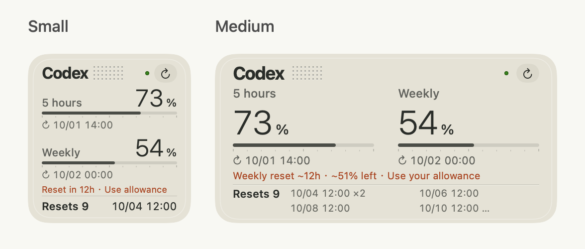

# User guide

[Download](https://github.com/youcaihua007/codex-t3/releases/latest) · [Feedback](https://github.com/youcaihua007/codex-t3/issues/new/choose) · [简体中文](../README.md) · [Security & privacy](../SECURITY.md) · [Release guide](RELEASING.md)

A native macOS desktop widget that shows the remaining usage allowance for the account signed in to Codex on your Mac. Inspired by Braun T3 industrial design, it uses a flat palette, a capital C with a dot grid, and simple progress bars.

The English interface follows OpenAI's terminology: **usage limits**, **remaining allowance**, and **rate-limit resets**. The widget abbreviates earned rate-limit resets as **Resets**; these are separate from purchased usage credits. See the official [Codex pricing documentation](https://learn.chatgpt.com/docs/pricing) and [app-server documentation](https://learn.chatgpt.com/docs/app-server).



## Features

- Follows the system language on first install, with English fallback. The Display tab lets you choose Follow system, 简体中文 or English; the saved choice applies to the app, widgets and notifications.
- Native small and medium widgets, with layouts that adapt to one or two usage limit windows returned by Codex.
- Both sizes show remaining percentages, progress bars and each window's reset date and time. Small shows the number of available rate-limit resets and the next known expiry; medium also shows the expiry details.
- Cached or unavailable data is clearly marked.
- A quiet medium-widget header: name, dot grid, status dot and refresh button while healthy; a short caption during sync or when data is unavailable. The last refresh time is shown in Account / Sync settings.
- Widget refresh button; automatic polling every 1, 2 or 5 minutes.
- Independent warning thresholds for the remaining five-hour and weekly percentages.
- Current account name, email and plan in settings; previous usage data is cleared when the account changes.
- Separate switches for the menu bar icon and remaining percentages, plus optional launch at login, low allowance notifications and reset expiry notifications.
- Optional allowance restoration, verified account or workspace change, and unused weekly allowance notifications, each with its own switch.
- Compact menu bar display prioritizes the limit that needs attention. Each window's label and remaining percentage are still shown in the expanded menu.
- Retry backoff, network / wake recovery, Codex executable selection and version display.
- Unused weekly allowance reminder, with a choice of 6, 12, 24, 48 or 72 hours before the reset and an adjustable threshold for projected remaining allowance. Widgets show a short note when the reminder conditions are met.

## Requirements and current validation

Deployment target: macOS 14. Tested on macOS 27.0.1 with Apple Silicon and Xcode 27. A user also confirmed working widgets on macOS 27.0 / M4 after removing old copies and reinstalling. Earlier macOS versions have not been runtime-tested. Universal builds include arm64 and x86_64; Intel compilation passed, but Intel runtime is untested. The current icon resource format requires full Xcode; use the validated Xcode 27 toolchain.

Install a compatible Codex executable that supports `app-server`, then sign in with your ChatGPT account. API key authentication does not expose the subscription usage limits this app needs. The project is independent of OpenAI, ChatGPT, Codex and Braun, and is not endorsed by them. It uses original artwork inspired by T3, not their official logos.

## Build and install

**Current release: 1.0 (build 51), the first public version.**



[About and the complete project link](images/en/about.png) · [Language and display settings](images/en/display.png)

Settings have four icon tabs: **Account**, **Display**, **Alerts**, and **About**. Account contains sign-in and sync details; Display contains language, widget, menu bar and startup options; Alerts contains warning thresholds and all notification controls. The window keeps the same size when switching tabs or expanding controls and previews. Scroll indicators have a reserved gutter so they cannot cover content. A footer hint appears when more settings are available below and disappears at the bottom; navigation stays visible.

Usage trends, automatic history collection, storage and charts have been removed; upgrading clears the old archive. When enabled, the unused weekly allowance reminder reuses normal refreshes and keeps just three temporary measurements in memory to estimate usage over the most recent one to two hours. Disabling it clears them. It adds no requests, timers or saved history.

Optional notifications default to off and can be enabled in Alerts. Allowance restoration notifications require an observed change from 0% to available allowance for the five-hour or weekly window. Both windows may notify at the same time. Without an earlier valid reading, the first sync does not count as restoration; valid observations and notification deduplication persist across restarts. The unused weekly allowance reminder requires one hour of valid samples and three consecutive qualifying readings at least 30 seconds apart, and notifies at most once per cycle. It has its own switch. Stale or offline data and an in-progress refresh do not trigger new notifications.

Every notification switch has an explanatory caption. Enabling one shows its options directly below the switch and opens a relevant preview. Low allowance thresholds remain adjustable when notifications are off because they also control widget percentage colors. The low allowance and unused weekly allowance previews offer small and medium widgets or notification styles; allowance restoration, account changes and reset expiry show notification previews. Restoration previews cover the five-hour window, the weekly window or both. Previews can be collapsed and use synthetic data only. They do not query accounts, send notifications or change live widget readings.

[Unused weekly allowance preview](images/en/weekly-surplus.png) · [72-hour lead and custom threshold](images/en/weekly-72h.png) · [Reset expiry preview](images/en/reset-expiry.png)

The unused weekly allowance reminder defaults to 12 hours before the reset, with options for 6, 12, 24, 48 and 72 hours. A slider sets the projected remaining allowance threshold from 0–100%, with a default of 5%. The projected allowance must be strictly above the threshold, and any short usage window must still have allowance available. A threshold of 100% never triggers a reminder. Both widget sizes show a small warm-brown note above Resets, even without notification permission. Widgets do not show exhaustion forecasts or sampling status. Delivering a notification does not dismiss the note. A reset, stale or exhausted data, insufficient projected allowance, or disabling the feature clears it. Saved time choices that are still supported are preserved; the removed one-hour option changes to 12 hours.




Verified account/workspace changes open account settings when clicked. Notification state persists locally across restarts; reminders reuse existing refreshes without new requests or timers.

Compact menu bar display defaults to off. It prioritizes an exhausted limit, then the lowest remaining percentage, and keeps the 5h or Week label. The expanded menu shows every returned usage limit window.

The current package uses local ad-hoc signing and is not Developer ID signed or notarized. It can be distributed through GitHub, but macOS may block the first browser-downloaded launch. Users who trust the source can follow [Apple's Open Anyway instructions](https://support.apple.com/102445). Developer ID signing and notarization are needed to pass default Gatekeeper checks; they do not require App Store distribution. Building from source is also supported. See the [release guide](RELEASING.md).

```sh
python3 Scripts/test.py
python3 Scripts/build.py --arch universal --derived-data /tmp/codex-t3-release
python3 Scripts/install.py "/tmp/codex-t3-release/Build/Products/Release/Codex T3.app"
python3 Scripts/package.py "/tmp/codex-t3-release/Build/Products/Release/Codex T3.app"
```

The installer backs up the old version to `build/backups/`, preserves preferences and refreshes the installed extension registration. Use `--destination "$HOME/Applications"` for a user application directory. Keep one active installation to avoid conflicting extension registrations.

If widget content appears normally but the gallery app icon remains a system placeholder, see the manual icon-cache repair in [the release guide](RELEASING.md#图标资源). It does not run automatically at startup or installation.

Download `Codex-T3-VERSION-universal.dmg` from the release page. Open it, drag **Codex T3.app** to **Applications**, then open the installed app from Applications and eject the disk image. For an upgrade, quit the old app first and run just one installed copy. The DMG contains the app and an Applications shortcut; the license is inside the app, while documentation and screenshots stay in the repository. The app-only ZIP is retained for the built-in updater.

Open the app and check the account in settings. Right-click the desktop, choose **Edit Widgets**, search for **Codex T3 · Usage Limits Widget**, then choose a small or medium widget. Right-click an existing desktop widget to change its size. The Display tab provides a size preview picker; it does not change the desktop widget size. The app must remain running to sync. Closing settings keeps the background service active; quitting the app marks the last reading as unavailable. WidgetKit controls when the desktop widget is rendered, so polling does not guarantee updates every second. The refresh button waits for the query result.

Every widget size and instance shares the app's usage snapshot and adds no separate polling. Small widgets show a reset time below each progress bar, with the available rate-limit reset count and next known expiry in the footer (MM/dd HH:mm). Missing expiry details are marked unknown; a dash appears when no resets are available. Medium widgets show additional reset expiry details.

The app uses the Codex account signed in on this Mac. On another computer, it reads the account signed in there. If you use custom `CODEX_HOME` directories, launch the app and Codex with the same environment; a Finder launch does not inherit terminal environment variables. Each poll reads the account again. After switching accounts, use refresh to check immediately.

Discovery checks bundled Codex executables in ChatGPT and Codex, the user application directory, Homebrew and absolute PATH directories. Settings allow an explicit executable override.

## Updates and feedback

About shows the app version. Check for updates looks for the latest stable release in the public GitHub repository. The app downloads a compatible archive, verifies it, then offers Install and restart. An installation error restores the previous app. If the installation folder is not writable, use the release page for a manual replacement.

The update and feedback source is built in: [youcaihua007/codex-t3](https://github.com/youcaihua007/codex-t3). About shows a read-only project link; users do not enter or change a repository. Legacy manual settings cannot override the embedded source. Fork maintainers can embed their own URL with `Scripts/build.py --repository https://github.com/OWNER/REPO`; CI embeds its own repository. Upload `Codex-T3-VERSION-universal.zip` (or the matching architecture) and its `.zip.sha256` file. GitHub's SHA-256 digest is preferred, with the sidecar as a fallback. Packages without integrity information require a manual download; drafts, prereleases and equal/older versions are not installed.

The updater verifies SHA-256, ZIP paths/types/sizes/CRC, native architecture, bundle identifiers, app/widget versions and code signatures. For Developer ID-signed installations, the Apple certificate anchor and Team ID must match. Ad-hoc distribution trusts the embedded HTTPS GitHub repository; its checksum is not independent publisher authentication.

Feedback opens GitHub Issues for you to complete and submit. No account data or logs are sent automatically. Update requests use no login tokens, GitHub authentication or cookies. They run only when you check for updates, with no periodic background polling.

## Development and privacy

`python3 Scripts/test-sandbox-bridge.py` validates real sandbox communication with new temporary signed identities, rejects unrelated clients and hosts, and checks refreshes. Mixed native/Rosetta scenarios run when Rosetta is available. No live credentials or widget state are accessed.

`python3 Scripts/test.py --ui` additionally verifies Cocoa window lifecycle and paused countdowns on a logged-in desktop. Tests use synthetic accounts and temporary directories, never live credentials. CI runs isolated checks and a universal build without automatically publishing a release.

The app queries local `codex app-server` through `account/read` and `account/rateLimits/read`. It reads local sign-in metadata only to display the matching account name. There is no app telemetry, remote log upload or separate usage limit proxy. Codex itself connects to its service.

Local Mach messages authenticate the kernel-provided user identity and installed code signatures at both ends, without accessing another process’s sandbox container. Widget messages and the cache contain usage summaries without names, emails, account IDs or tokens. App preferences retain an account-specific rate-limit reset cache and notification state. See [SECURITY.md](../SECURITY.md).

Usage limit and rate-limit reset fields depend on the upstream protocol. Layout follows the windows actually returned by Codex. If a protocol error occurs, check your sign-in and Codex executable version.

DMG installers, app-only update archives and SHA-256 files go to `dist/`. Building the DMG requires Python 3.10+ with `Scripts/requirements-packaging.txt`; see the release guide. Generated binaries, backups, logs, credentials and local settings are excluded from version control. Contributions follow [CONTRIBUTING.md](../CONTRIBUTING.md). Licensed under [MIT](../LICENSE).
