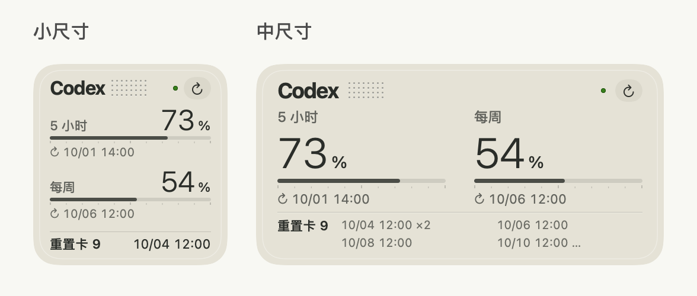
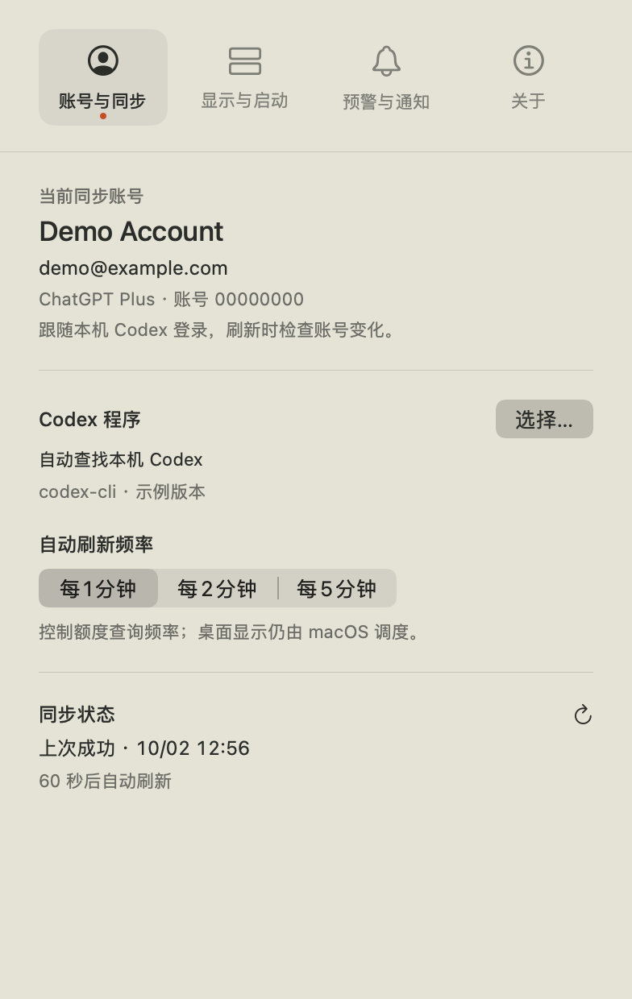
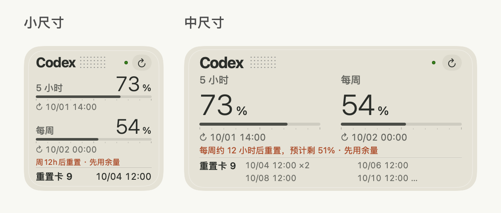

# 使用指南

[下载最新版](https://github.com/youcaihua007/codex-t3/releases/latest) · [提交反馈](https://github.com/youcaihua007/codex-t3/issues/new/choose) · [English](../README.en.md) · [隐私与安全](../SECURITY.md) · [发布指南](RELEASING.md)

一个受 Braun T3 工业设计启发的 macOS 桌面小组件，用于查看本机 Codex 登录账号的剩余额度。平面配色、大写 C 与点阵图标，搭配简洁的进度条。



## 功能

- 原生小、中两种尺寸：两种都展示额度百分比、进度条和各窗口的重置日期与时间。小尺寸显示重置卡数量与最近到期时间，中尺寸显示到期明细。
- 根据服务返回的窗口显示 5 小时和每周额度；两种尺寸均自动适配只有一个额度窗口的账号。
- 中尺寸顶部正常时仅保留名称、点阵、状态点与刷新按钮，同步或异常时显示简短提示。刷新时间在「账号与同步」查看；缺少重置卡到期详情时标明缓存或未知状态。
- 小组件内刷新按钮；自动刷新可选每 1、2、5 分钟。
- 5 小时与每周独立预警阈值，剩余百分比达到阈值或更低时变红。
- 设置显示当前账号名称、邮箱与方案；切换账号时清除旧额度后重新读取。
- 菜单栏图标与额度显示分别开关；精简模式仅显示最需关注的一项，展开菜单仍可查看全部额度；可选登录时启动。
- 独立开关控制低额度、额度恢复、账号切换、每周余量使用和重置卡到期通知；联网与唤醒后恢复刷新，失败时退避重试。
- 显示本机 Codex 程序路径与版本，支持手动选择可执行程序。
- 首次安装跟随系统语言，其他语言回退英文；「显示与启动」可切换跟随系统、简体中文或 English，保存选择并同步到组件与通知。
- 关于页显示应用版本；从公开 GitHub Releases 检测、下载、校验、安装更新并重启，支持建议与反馈入口。
- 每周余量提醒可选提前 6、12、24、48、72 小时，并自由设置预计余量阈值；满足条件时小组件增加一行小字。

设置分为四页，使用顶部图标切换：**账号与同步**、**显示与启动**、**预警与通知**、**关于**。预警阈值与所有通知提醒统一在「预警与通知」设置。切换分类、展开选项和示例时，窗口保持相同大小。滚动条有独立留白，不遮住内容；下方还有内容时，底部显示「向下滚动查看更多设置」，滚到底后提示隐藏。顶部分类始终保持可见。



[显示与启动示例](images/设置-display.png) · [预警与通知示例](images/设置-alerts.png) · [关于示例](images/设置-about.png)

## 运行条件

- 项目部署目标为 macOS 14；已在 macOS 27.0.1 / Apple Silicon 验证，另有 macOS 27.0 / M4 清理旧副本后重新安装成功的用户反馈。macOS 14–26 尚未实机测试。
- 通用构建包含 arm64 / x86_64；Intel 架构已编译，尚未在 Intel 机器上运行验证。
- 本机已有支持 `app-server` 的 Codex 可执行程序，并通过 ChatGPT 账号登录。API Key 登录不提供本组件需要的订阅额度。
- 编译当前图标资源需要完整 Xcode。已验证 Xcode 27，建议使用同版本工具链。

这是第三方独立项目，与 OpenAI、ChatGPT、Codex 或 Braun 无隶属或认可关系。T3 是设计灵感来源。本项目不包含上述品牌的官方标志。

## 安装与使用

**当前版本：1.0（构建 51），首次公开发行。**

当前应用包使用本地 ad-hoc 签名，尚未经过 Developer ID 签名与 Apple 公证。可以通过 GitHub 分发，但浏览器下载后 macOS 可能阻止首次打开；确认来源可信后，可按 [Apple 官方说明](https://support.apple.com/zh-cn/102445) 在「隐私与安全性」中选择「仍要打开」。若要通过默认 Gatekeeper 检查，需 Developer ID 签名与公证；这不要求上架 App Store。也可从源码自行构建，详见[发布指南](RELEASING.md)。

1. 从[发布页](https://github.com/youcaihua007/codex-t3/releases/latest)下载 `Codex-T3-版本-universal.dmg`，双击打开，将 `Codex T3.app` 拖到窗口右侧的「应用程序」。复制完成后从「应用程序」打开，再推出安装磁盘。升级时先退出旧 App，只运行新安装的一个副本。
2. 在设置中核对账号、Codex 路径和刷新频率。
3. 在桌面空白处右键 →「编辑小组件」，搜索 **Codex T3 · 额度小组件** 并选择小或中尺寸。已添加的组件可通过右键菜单切换尺寸。
4. 设置的「显示与启动」提供两种尺寸预览；预览选择不会改变系统中的桌面组件尺寸。
5. 主程序需保持运行；关闭设置窗口后仍会在后台刷新。完全退出后，小组件保留上次读数并标记无法同步。

不同尺寸和多个实例共享主程序的一份额度读数，不会分别启动新的定时查询。小尺寸在每条进度条下显示重置时间，底部显示重置卡数量，以及可用卡片中已知的最近到期日期和时间（MM/dd HH:mm）。没有到期明细时显示「到期未知」，没有可用卡时显示「—」；更多卡片的到期明细在中尺寸中查看。

组件绑定的是本机所选 Codex 程序使用的登录状态，不包含作者的账号。换到另一台电脑会读取那台电脑的登录；有多个登录目录时，需要保证启动应用与 Codex 使用一致的 `CODEX_HOME`。Finder 启动不会自动继承终端设置的环境变量。每轮刷新重新读取账号，切换后可点击刷新立即核对。

用量趋势及其历史采集、存储和绘图已移除，升级会清除旧归档。每周余量提醒开启时，仅复用正常刷新，在内存保留三个临时读数用于最近一至两小时的判断；关闭即清除，不写入历史、不增加查询或定时器。

主程序定时查询并请求 WidgetKit 更新，WidgetKit 最终决定桌面刷新时机；这不是逐秒实时显示。小组件手动刷新会等待查询完成后显示结果。

新增通知默认关闭，全部在「预警与通知」开启。5 小时与每周恢复分别判断，只有实际观察到 0% 恢复为可用才通知，没有此前有效读数时，首次同步不会推断恢复；有效观测与去重记录在重启后保留，两者同时恢复可分别通知。每周余量提醒需至少 1 小时有效采样，并连续三次判断符合条件（计数间隔至少 30 秒）后，每个周期最多通知一次。它只受自己的开关控制；离线、过期和正在刷新的读数不触发新提醒。

所有通知开关下方显示触发条件与用途说明；开启后，提前时间直接出现在对应开关下面，并自动展开效果示例。低额度阈值始终可调整，同时控制组件百分比颜色与通知条件，关闭通知不影响颜色设置。低额度与每周余量可切换小、中尺寸组件或通知示例；恢复、切换账号与重置卡到期展示系统通知样式。恢复示例可选择 5 小时、每周或两者同时。示例可收起，仅使用演示数据，不查询账号、发送通知或改变真实组件读数。

[每周余量效果示例](images/设置-example-weeklySurplus.png) · [72 小时与自定义阈值](images/设置-weekly-72h.png) · [重置卡到期示例](images/设置-example-card.png)

每周余量提醒默认在重置前 12 小时内检查，可选提前 6、12、24、48 或 72 小时；预计余量阈值可通过滑块设置为 0–100%，默认 5%。只有按近期每周消耗判断重置时余量大于所设比例，且当前额度可用时才提醒安排任务；100% 不会触发提醒。两种尺寸的组件在重置卡上方显示一行暖棕色小字，不显示耗尽预测或采样状态。系统通知未获允许时，组件仍可提醒；条件成立时保持显示，重置、读数过期、额度耗尽或关闭选项后消失。已有的有效时间选择会保留，旧版 1 小时选择改为 12 小时。




确认切换账号或工作区后才发送账号提示，点击通知可核对当前绑定账号。提醒复用原有刷新，去重状态仅保存在本机。

「显示与启动」的菜单栏精简模式默认关闭。开启额度文字后可启用，优先展示已耗尽的窗口，否则选择剩余百分比最少的一项；始终保留「5h／周」标识。菜单展开后仍显示全部窗口额度。

自动查找顺序为 ChatGPT 内置 Codex、Codex 桌面应用、用户应用目录、Homebrew / `/usr/local/bin` 和绝对 PATH 目录。找不到或版本不兼容时，在设置中手动选择或更新 Codex。

## 从源码构建

在源码根目录执行：

```sh
python3 Scripts/test.py
python3 Scripts/build.py --arch universal --derived-data /tmp/codex-t3-release
python3 Scripts/install.py "/tmp/codex-t3-release/Build/Products/Release/Codex T3.app"
python3 Scripts/package.py "/tmp/codex-t3-release/Build/Products/Release/Codex T3.app"
```

安装脚本会备份旧版本到 `build/backups/`、保留偏好设置，并重新注册正式安装位置的扩展。也可通过 `--destination "$HOME/Applications"` 安装到用户应用目录。请只保留一个正在使用的安装位置，避免多个副本的 WidgetKit 注册互相干扰。

如果组件内容正常，图库左侧却显示系统默认图标，见[图标缓存修复说明](RELEASING.md#图标资源)。此修复为手动维护操作，不会在后台自动清理缓存。

`python3 Scripts/test-sandbox-bridge.py` 使用全新临时签名身份验证真实沙盒通信、双方身份校验、刷新与陌生应用拒绝；有 Rosetta 时也检查混合架构。它不读取真实账号或真实组件状态。

`python3 Scripts/test.py --ui` 还会验证 Cocoa 窗口释放与倒计时暂停，需要本机已登录的图形桌面。测试全部使用合成账号和临时目录，不访问真实登录凭据。

发布包在 `dist/`，附 SHA-256 校验文件。DMG 用于拖拽安装，ZIP 只保留 App 用于内置更新；许可证随 App 保存，说明与截图留在仓库。生成 DMG 需要 Python 3.10+ 与 `Scripts/requirements-packaging.txt`，见[发布指南](RELEASING.md)。源码仓库忽略构建产物、备份、日志、密钥与本地状态。GitHub Actions 执行隔离测试及通用构建，不自动发布 Release。

## 更新与反馈

在「关于」点击「检测更新」。发现新版本后可下载，经 SHA-256、压缩包和代码签名验证后，点击「安装更新并重启」。当前应用和用户偏好分开保存，替换或启动请求失败时恢复旧版本。安装目录不可写时可从发布说明页手动下载替换。

更新和反馈来源已内置为 [youcaihua007/codex-t3](https://github.com/youcaihua007/codex-t3)，用户无需填写或更改仓库。在「关于」可直接打开项目主页、检测更新和提交反馈。更新读取此项目最新正式 Release，不安装 draft 或 prerelease；旧版手动仓库设置不会覆盖内置来源。开发者分发自己的 fork 时，可用 `Scripts/build.py --repository https://github.com/OWNER/REPO` 在构建时替换地址；Actions 自动内置当前仓库。

发布页提供 DMG 和校验文件用于首次安装；内置更新的应用包必须同时提供 `Codex-T3-版本-universal.zip` 或对应架构的命名，上传 ZIP 和同名 `.zip.sha256` 附件。优先使用 GitHub 返回的 SHA-256 digest，缺失时使用校验附件；没有校验信息时仅允许手动下载。更新版本必须大于当前版本，包内主程序和组件版本必须一致。

「提交建议与反馈」会打开 GitHub Issues 的模板选择页，由用户填写并提交；应用不会自动发送账号或日志。更新请求不使用登录 token、Cookie 或 GitHub 认证，且仅在点击检测/下载后执行，不增加后台定时轮询。

## 数据与权限

应用通过本机 `codex app-server` 查询 `account/read` 与 `account/rateLimits/read`。账号名称来自本机登录资料，只用于设置显示。应用自身没有遥测、远程日志上传或额外额度代理服务器；Codex 仍会连接其服务端查询。

小组件与主程序通过本机 Mach 消息通信，双向核对内核提供的用户身份及当前安装代码签名，不读写彼此的沙盒容器。通信与组件缓存只包含额度摘要，不包含账号姓名、邮箱、ID 或登录 token。详见 [SECURITY.md](../SECURITY.md)。

额度窗口和重置卡字段随 Codex 协议与服务返回而变化；布局以实际返回为准，不仅根据 Plus / Pro 名称猜测窗口。若同步失败，请先确认本机 Codex 已登录并更新到兼容版本。

## 许可证

[MIT](../LICENSE)。欢迎提交问题与改进，贡献前请阅读 [CONTRIBUTING.md](../CONTRIBUTING.md)。
